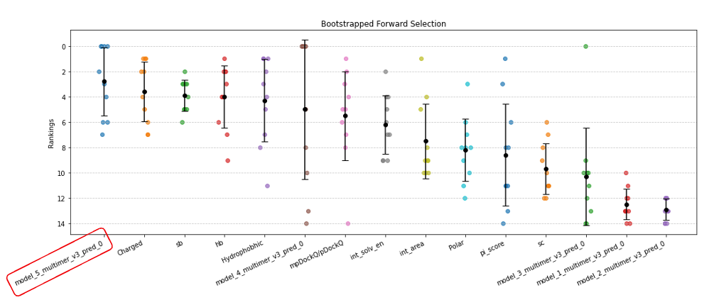

# Protein_Heterodimer_SVM
# A machine learning model for large-scale discovery of protein interactions with AlphaFold2

This project is to build a SVM model based on AlphaPulldown (https://github.com/KosinskiLab/AlphaPulldown) pipeline. This pipeline is based on AlphaFold 2. 

## Table of Contents

- [Installation](#installation)
- [Data](#data)
- [Model](#model)
- [Contributing](#contributing)
- [License](#license)

## Installation

This project used AlphaPulldown version 1.0.
Check Alphapulldown package's pre-installation and installzation part. Harvard FAS has pre-installed alphafold 2 database "/n/holylfs04-ssd2/LABS/FAS/alphafold_database". Make sure if all folders are updated to the newest version (https://github.com/google-deepmind/alphafold). 

## Data

### Protein pairs collection

The Positive dataset is from PDB bank. The negative dataset is random paifr between Archaea and Homo Sapien (Uniprot). 

### Multiple sequence alignment (MSA)

Multiple sequence alignment (MSA) runs on CPUs. Alphapulldown accepts two MSA methods: the default AlphaFold version (slower), and the MMseq2 version (much faster). The accuracy of final prediction models depends on the MSA method chosen here. 
To run 500 protein sequence (not protein pairs) on Cannon in parallel, use ``msa.sh`` file with the following Slurm command:

```bash
sbatch --array=0-500 \
"/path/msa.sh" \
"/path/6000_tn_input.fasta" \
"" \ # Default usage of Harvard FAS Alphafold database
"/path/msa_outputs"
```

Normally, each MSA job takes ~15 minutes.

### Predict structures

Prediction step runs on GPU. To run 500 protein pairs (not protein sequences) on Cannon in parallel, use ``prediction.sh`` file with the following Slurm command:

```bash
sbatch --array=0-500 \
"/path/prediction.sh" \
"" \ Default custom mode
"/path/outputs/negative_0to1000" \
"" \ # Default usage of Harvard FAS Alphafold database
"/path/6000_tn_pairs.txt"
"/path/msa_outputs"
```
The default mode in ``prediction.sh`` is custom mode (self-defined pairs). You can explore other modes by reading AlphaPulldown manuals (https://github.com/KosinskiLab/AlphaPulldown/tree/main).

Do not submit too many jobs at one time if finishing all jobs takes more than 5 hours. 

For each protein pair there will be 5 models generated based on different initiation locations. For each model it will take ~5 minutes when running in GPU.

You could check the usage of GPUs using: 
``sacct --format=JobID,Jobname,partition,state,time,start,end,elapsed,ReqMem,MaxRss,nnodes,ncpus,nodelist -j <your job ID> --units=G``
to find the running GPU id. Then use the command: ``cd <GPU id>`` and type ``nvtop``. There will be dynamic GPU usage chart. 

If the prediction step does not use GPU even with proper GPU partitions, consider reinstalling the AlphaPulldown.

### Computing the protein interface features

Running the sandbox to write the final interface features into a csv file ``predictions_with_good_interpae.csv``. In the default ``alpha-analysis.sif``, there is a cut-off parameter to filter protein pairs based on PAE (predicted alignment error) values. To save more negative pairs with high PAE values, I manually modified this sigularity image in its sandbox replicate to inactivate the cutt-off filter. You need to replace the former ``/alpha_analysis/app/alpha-analysis/get_good_inter_pae.py`` with my modified version ``get_good_inter_pae.py''. Use the following commmand to generate a sandbox replicate using ``build_sandbox.sh``:

```bash
sbatch "/path/sandbox_path" "/path/alpha-analysis.sif"
```

After replacing ``get_good_inter_pae.py`` files, modify the ``feature_computing_sandbox.sh`` by changing the sandbox path:

```bash
# In the modified sandbox,  the cutoff variable is already inactivated. Therefore just give it an random integer.
cutoff=50
bind_path=$1
singularity exec \
    --no-home \
    --bind "$bind_path":/mnt \
    /path/sandbox_path \ # assign the sandbox directory
    run_get_good_pae.sh \
    --output_dir=/mnt \
    --cutoff=$cutoff
```

Then run the following command to compute protein interface features using ``feature_computing_sandbox.sh``.

```bash
sbatch feature_computing_sandbox.sh "/path/outputs/negative_0to100"
```

This step runs on CPU. If there are more than 1000 pairs to be calculated, the running time will be too long. Since the script is unable to skip existing pairs, it is recommended that each 1000 pairs should be saved in a seperate folder waiting for feature calculation. To ensure the integrity of the sandbox environment, it's advisable to reconstruct it periodically, especially after prolonged periods of inactivity, as the cleanup process may remove unmodified files.

Final data is ``full_updated_data.csv``

## Model

| idx | Features                                         | Kernel  | Model complexity | Test accuracy | Test false positive rate | # support vector | Bootstrap?      |
|-----|--------------------------------------------------|---------|------------------|---------------|--------------------------|------------------|-----------------|
| 1   | 10 basic interface features                      | rbf     | 0.2092           | 0.9128        | 0.0337                   | 1382             | No              |
| 2   | 12 features (add 'iptm_ptm', 'mpDockQ/pDockQ')   | rbf     | 0.1715           | 0.9243        | 0.0169                   | 1133             | No              |
| 3   | 12 features (add 'iptm_ptm', 'mpDockQ/pDockQ')   | linear  | 0.1577           | 0.9249        | 0.0233                   | 1042             | No              |
| 4   | 13 features (add 'pi score')                     | rbf     | 0.1676           | 0.9231        | 0.0169                   | 1107             | No              |
| 5   | 13 features (add 'pi score')                     | linear  | 0.1567           | 0.9237        | 0.0220                   | 1035             | Yes             |
| 6   | 17 features (remove 'iptm_ptm', add 5 'model_x_multimer_v3_pred_0') | rbf | 0.1523 | 0.9268 | 0.0143 | 1006 | No              |
| 7   | 17 features (remove 'iptm_ptm', add 5 'model_x_multimer_v3_pred_0') | linear | 0.1425 | 0.9298 | 0.0155 | 941  | Yes (best)      |
| 8   | 15 features (remove 'Num intf residues' and 'contact pairs') | linear | 0.1425 | 0.9310 | 0.0156 | 944  | Yes             |

### Feature importance



The least confident model's score becomes the most important feature. 

## Contributing

Outline guidelines for contributing to the project, such as how to report bugs, suggest enhancements, or submit pull requests.

## License

This project is licensed under the [MIT License](LICENSE.txt) - see the [LICENSE.txt](LICENSE.txt) file for details.
